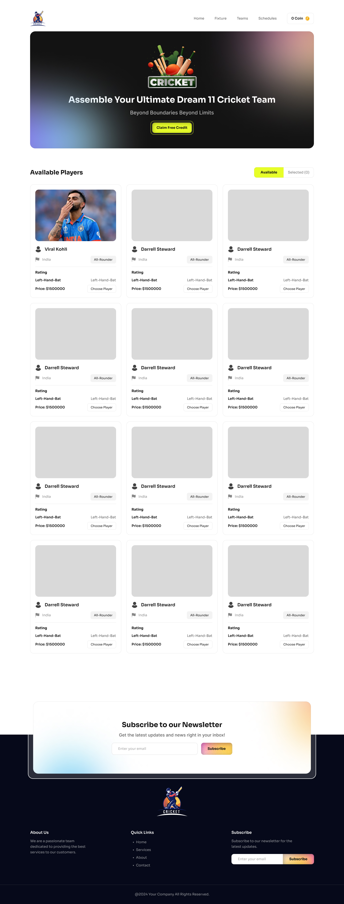

# Dream11 Team Builder

Dream11 Team Builder is an interactive and engaging web application that allows users to assemble their ultimate cricket team. With a set coin balance, users can select players based on bidding prices, manage their team lineup, and receive live feedback on their actions.

## Technologies Used
- **React** - Component-based UI development.
- **Tailwind CSS** - Responsive and customizable styling.
- **React Toastify** - User notifications for feedback.

## Key Features
1. **Dynamic Coin Management**: Users can increase their coins and spend them on player selections, maintaining a balance in real-time.
2. **Player Selection with Validation**: Allows up to 6 player selections per team with warnings for insufficient coins or duplicate selections.
3. **Interactive Team Building Experience**: Displays selected players, allows easy removal, and provides feedback on selection errors and actions via toast notifications.
 
 

---
